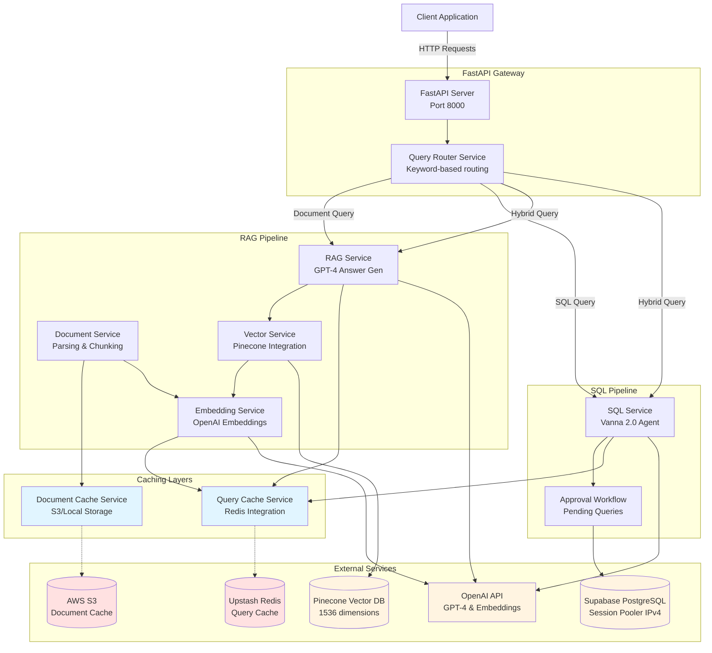

# System Architecture

## Overview
High-level architecture showing all major components, services, external dependencies, and caching layers of the Multi-Source RAG + Text-to-SQL system.

## Architecture Diagram

## Key Components

### FastAPI Gateway
- **API Server**: Main entry point on port 8000
- **Query Router**: Analyzes queries using 60+ keywords to route to SQL, RAG, or HYBRID paths
- **Endpoints**: `/query`, `/upload`, `/documents`, `/sql/*`, `/cache/*`, `/stats`, `/health`

### RAG Pipeline
- **Document Service**: Parses PDFs (Docling), DOCX, CSV, JSON with context-aware chunking
- **Embedding Service**: Generates embeddings using OpenAI text-embedding-3-small (1536 dimensions)
- **Vector Service**: Manages Pinecone vector operations (upsert, search, delete)
- **RAG Service**: Retrieves relevant chunks and generates answers with GPT-4

### SQL Pipeline
- **SQL Service**: Vanna 2.0 Agent with GPT-4o for Text-to-SQL generation
- **Approval Workflow**: Two-step process (generate → review → execute)
- **Training**: Automatic schema learning + 10 golden query examples

### Caching Layers
- **Query Cache**: Redis-based with 1h-24h TTLs (RAG answers, SQL generation, embeddings)
- **Document Cache**: S3/Local storage for chunks, embeddings, metadata (deduplication via SHA-256)

### External Services
- **OpenAI**: GPT-4 (reasoning), GPT-4o (SQL), text-embedding-3-small (embeddings)
- **Pinecone**: Vector database with cosine similarity search
- **Supabase**: PostgreSQL with Session Pooler (IPv4 for Lambda compatibility)
- **Upstash Redis**: Serverless Redis for query caching
- **AWS S3**: Object storage for document cache (or local fallback)

## Data Flow

1. **Client Request** → FastAPI Gateway
2. **Query Routing** → Router analyzes keywords
3. **Processing Path**:
   - **SQL**: Vanna generates SQL → User approval → Execute on Supabase
   - **RAG**: Embed question → Search Pinecone → GPT-4 answer
   - **HYBRID**: Execute both paths in parallel → Combine results
4. **Caching**: Check Redis for cached responses (5-10ms vs 2-5s API calls)
5. **Response** → Return to client with sources/SQL

## Performance Characteristics

| Component | Latency | Cache Hit Rate | Cost per 1K Queries |
|-----------|---------|----------------|---------------------|
| Redis Query Cache | 5-10ms | 40-60% | $0.01 |
| S3 Document Cache | 100-200ms | 70-80% | $0.05 |
| Pinecone Search | 50-100ms | N/A | $0.10 |
| OpenAI Embeddings | 200-500ms | 60% (cached) | $0.13 |
| OpenAI GPT-4 | 2-5s | 40% (cached) | $15-30 |

## Deployment

- **Development**: Local storage, SQLite fallback
- **Production**: AWS Lambda + S3 + Upstash Redis + Pinecone + Supabase
- **Monitoring**: OPIK tracing (optional)

## Related Workflows
- [Service Initialization](07-service-initialization.md) - How components start up
- [Unified Query Flow](02-unified-query-flow.md) - Request routing logic
- [Multi-Level Cache](06-multi-level-cache.md) - Caching strategy details
