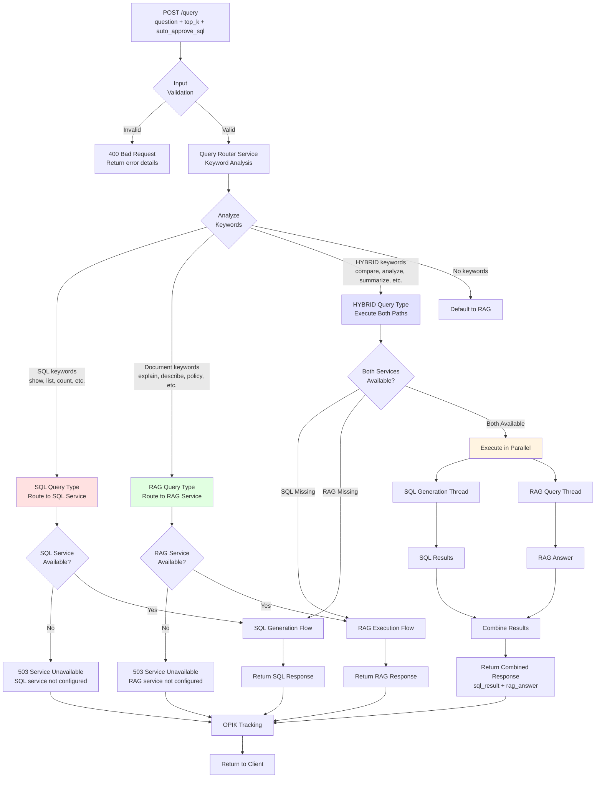

# Unified Query Flow

## Overview
Main entry point for all queries showing how the Query Router analyzes natural language and routes to SQL, RAG, or HYBRID execution paths based on keyword detection.

## Flow Diagram



## Key Components

### Query Router Service
Located in `app/services/router_service.py`

**Keyword Categories:**
- **SQL Keywords (30+)**: `show`, `list`, `count`, `total`, `how many`, `sales`, `revenue`, `orders`, `customers`, `products`, `top`, `bottom`, `average`, `sum`, `group by`, etc.
- **Document Keywords (25+)**: `what is`, `explain`, `describe`, `tell me about`, `how does`, `policy`, `procedure`, `documentation`, `guide`, `definition`, `overview`, etc.
- **HYBRID Keywords (8+)**: `compare`, `analyze both`, `summarize`, `combine`, `correlate`, `relationship between`, `trend analysis`, `insights`

**Routing Logic:**
```python
if any HYBRID keyword → HYBRID type
elif any SQL keyword → SQL type
elif any DOCUMENT keyword → DOCUMENTS type
else → DOCUMENTS (default)
```

### Query Types

#### SQL Query
- **Purpose**: Database queries requiring data aggregation, filtering, or analytics
- **Examples**:
  - "How many customers ordered in 2024?"
  - "Show top 10 products by revenue"
  - "What's the average order value?"
- **Response**: `{query_type: "SQL", sql: "...", result: [...], execution_time: X}`

#### RAG Query
- **Purpose**: Information retrieval from documents
- **Examples**:
  - "What is our return policy?"
  - "Explain how to configure the API"
  - "Describe the authentication process"
- **Response**: `{query_type: "DOCUMENTS", answer: "...", sources: [...], chunks_retrieved: X}`

#### HYBRID Query
- **Purpose**: Combines database analytics with document context
- **Examples**:
  - "Compare sales trends and explain our pricing strategy"
  - "Analyze customer orders and summarize our shipping policy"
  - "Show revenue by region and describe our market expansion plans"
- **Response**: `{query_type: "HYBRID", sql_result: {...}, rag_answer: "...", combined_insight: "..."}`

### Service Availability Checks

Before routing, the system verifies:
- **SQL Service**: Requires `DATABASE_URL` + `OPENAI_API_KEY` configured
- **RAG Service**: Requires `OPENAI_API_KEY` + `PINECONE_API_KEY` configured

If a required service is unavailable:
- Returns HTTP 503 with clear error message
- Suggests configuration steps
- Graceful degradation for HYBRID queries (falls back to available service)

### Validation Rules

**Input Validation:**
- `question`: 3-1000 characters, non-empty, string type
- `top_k`: 1-10 (RAG queries), integer
- `auto_approve_sql`: Boolean (default: false)

**File Validation (for upload):**
- Types: PDF, DOCX, CSV, JSON
- Max size: 50 MB
- Extension must match content type

## Important Notes

- **Auto-Approve SQL**: When `auto_approve_sql=true`, SQL queries execute immediately without approval (useful for testing)
- **OPIK Tracking**: All queries are tracked with `@track` decorator if OPIK is configured
- **Cache Integration**: Router doesn't cache decisions, but downstream services use Redis caching
- **Error Handling**: Structured responses with error codes, messages, and suggestions

## Performance Metrics

| Query Type | Avg Latency | Cache Hit Rate | Typical Use Cases |
|------------|-------------|----------------|-------------------|
| SQL | 2-5s (gen) + 50-200ms (exec) | 60% (generation), 40% (results) | Analytics, reporting, aggregations |
| RAG | 1-3s (no cache) / 10ms (cached) | 40-60% | Documentation, policies, how-to guides |
| HYBRID | 3-8s (parallel) | 30-50% | Business intelligence, cross-domain insights |

## Related Workflows
- [RAG Query Execution](04-rag-query-execution.md) - Document query details
- [SQL Query Execution](05-sql-query-execution.md) - Text-to-SQL flow
- [System Architecture](01-system-architecture.md) - Overall system design
