# Document Upload Pipeline

## Overview
End-to-end flow showing how uploaded documents are validated, parsed, chunked, embedded, cached, and stored in vector database with automatic deduplication.

## Flow Diagram

```mermaid
flowchart LR
    Upload[POST /upload<br/>File Upload] --> Validate{Validate File<br/>Type & Size}

    Validate -->|Invalid Type| ErrorType[400 Bad Request<br/>Unsupported file type]
    Validate -->|Too Large| ErrorSize[400 Bad Request<br/>Max 50 MB exceeded]
    Validate -->|Valid| Hash[Compute SHA-256<br/>Content Hash]

    Hash --> Cache{Check Document<br/>Cache}

    Cache -->|CACHE HIT| LoadCache[Load from S3/Local<br/>chunks.json<br/>embeddings.npy<br/>metadata.json]
    Cache -->|CACHE MISS| Parse{Parse Document<br/>by Type}

    Parse -->|PDF| Docling[Docling Parser<br/>Layout-aware extraction]
    Parse -->|DOCX/CSV/JSON| Semchunk[Semchunk Parser<br/>Semantic chunking]

    Docling --> Chunk[Context-Aware Chunking<br/>256-512 tokens<br/>50 token overlap]
    Semchunk --> Chunk

    Chunk --> Embed[Generate Embeddings<br/>Batch Processing]

    Embed --> EmbedCache{Check Embedding<br/>Cache - Redis}

    EmbedCache -->|HIT| UseCache[Use Cached<br/>Embeddings]
    EmbedCache -->|MISS| CallOpenAI[OpenAI API<br/>text-embedding-3-small]

    CallOpenAI --> StoreEmbed[Cache Embeddings<br/>Redis 7-day TTL]
    StoreEmbed --> Batch[Batch Embeddings]
    UseCache --> Batch

    LoadCache --> Dedupe{Check Pinecone<br/>for Duplicates}
    Batch --> StoreDoc[Store in Document Cache<br/>S3/Local by SHA-256]

    StoreDoc --> Dedupe
    Dedupe -->|New Chunks| Upsert[Upsert to Pinecone<br/>Batch 100 vectors]
    Dedupe -->|Duplicates Found| Skip[Skip Duplicate Chunks<br/>Update Metadata Only]

    Upsert --> Invalidate[Invalidate RAG Cache<br/>DELETE rag:* keys]
    Skip --> Invalidate

    Invalidate --> Stats[Update Statistics<br/>documents_count<br/>chunks_count]

    Stats --> Response[200 OK Response<br/>document_id<br/>chunks_created<br/>cached: true/false]

    ErrorType --> End[Return to Client]
    ErrorSize --> End
    Response --> End

    style LoadCache fill:#e1f5ff
    style EmbedCache fill:#e1f5ff
    style StoreEmbed fill:#e1f5ff
    style StoreDoc fill:#e1f5ff
    style Invalidate fill:#ffe1e1
```



## Key Components

### File Validation
Located in `app/utils.py`

**Validation Rules:**
- **Supported Types**: PDF, DOCX, CSV, JSON
- **Max Size**: 50 MB (configurable via `MAX_FILE_SIZE_MB`)
- **Extension Check**: Validates file extension matches content type
- **Content Hash**: SHA-256 for deduplication across identical files

### Document Parsing

#### PDF Parsing (Docling)
- **Library**: `docling` (replaces pdfminer.six)
- **Features**: Layout-aware extraction, table detection, OCR support
- **Output**: Structured text with formatting preserved

#### Other Formats (Semchunk)
- **Library**: `semchunk` for DOCX, CSV, JSON
- **Features**: Semantic-aware chunking, preserves context boundaries
- **Output**: Text with logical section breaks

### Context-Aware Chunking
Located in `app/services/document_service.py`

**Strategy:**
- **Token-based**: Uses `tiktoken` with cl100k_base encoding (GPT-4)
- **Chunk Size**: 256-512 tokens (configurable)
- **Overlap**: 50 tokens to preserve context across boundaries
- **Metadata**: Includes filename, chunk index, source page/section

### Embedding Generation
Located in `app/services/embedding_service.py`

**Process:**
1. Check Redis cache for existing embeddings (key: `embedding:{text_hash}`)
2. If cache miss, call OpenAI API with batch processing
3. Store embeddings in Redis with 7-day TTL
4. Return 1536-dimensional vectors

**Cache Benefits:**
- 60% hit rate on repeated text chunks
- 200-500ms → 5-10ms latency reduction
- $0.13 per 1K chunks → near-zero cost for cached

### Document Cache Structure
Located in `app/services/document_cache_service.py`

**S3/Local Storage Layout:**
```
documents/
  {sha256_hash}/
    chunks.json          # Text chunks with metadata
    embeddings.npy       # NumPy array of vectors
    metadata.json        # Document info, timestamps
```

**Benefits:**
- Content-based deduplication (same file = same hash)
- Fast re-uploads (100-200ms vs 2-5s processing)
- Cost savings (avoid re-embedding identical documents)

### Pinecone Upsert
Located in `app/services/vector_service.py`

**Process:**
1. Batch vectors in groups of 100
2. Check for existing vectors by ID (deduplication)
3. Upsert with metadata: `{filename, chunk_index, text, timestamp}`
4. Update namespace statistics

**Deduplication:**
- Vector ID format: `{document_id}_{chunk_index}`
- Prevents duplicate uploads of same document
- Updates metadata for existing vectors

### RAG Cache Invalidation

**Trigger**: After successful document upload

**Action**: Delete all RAG response cache keys matching pattern `rag:*`

**Reason**: New documents may contain relevant information for previously cached queries

## Important Notes

- **SHA-256 Hashing**: Ensures identical files (same content) are only processed once
- **Batch Processing**: Embeddings generated in batches of 10-50 for efficiency
- **Graceful Errors**: Parsing failures don't crash the upload, return detailed error messages
- **Progress Tracking**: Large files show progress via streaming response (future enhancement)
- **Memory Management**: Large PDFs processed page-by-page to avoid OOM errors

## Performance Metrics

| Stage | First Upload | Cached Upload | Savings |
|-------|--------------|---------------|---------|
| File Validation | 10ms | 10ms | 0% |
| Document Parsing | 500-2000ms | 0ms (skipped) | 100% |
| Chunking | 200-500ms | 0ms (skipped) | 100% |
| Embedding Generation | 1000-3000ms | 50-100ms (Redis) | 95% |
| Document Cache Store | 100-200ms | 50ms (metadata update) | 50% |
| Pinecone Upsert | 200-500ms | 100ms (metadata only) | 50% |
| **Total** | **2-6 seconds** | **200-300ms** | **90%** |

## Example Scenarios

### Scenario 1: New PDF Upload
1. User uploads `pricing_policy.pdf` (5 MB)
2. SHA-256 hash computed: `abc123...`
3. Cache miss → Parse with Docling
4. Extract 15 pages → 45 chunks (512 tokens each)
5. Generate embeddings (30 cached, 15 new) → 45 vectors
6. Store in S3 under `documents/abc123.../`
7. Upsert 45 vectors to Pinecone
8. Invalidate RAG cache
9. Response: `{document_id: "doc_abc123", chunks_created: 45, cached: false}`

### Scenario 2: Re-upload Same File
1. User re-uploads `pricing_policy.pdf` (identical content)
2. SHA-256 hash: `abc123...` (same as before)
3. Cache HIT → Load from S3 (200ms)
4. Check Pinecone for existing vectors → All found
5. Update metadata timestamps only
6. Response: `{document_id: "doc_abc123", chunks_created: 45, cached: true}`

### Scenario 3: Similar File Upload
1. User uploads `pricing_policy_v2.pdf` (minor edits)
2. SHA-256 hash: `def456...` (different)
3. Cache miss → Parse with Docling
4. Generate embeddings (40 cached from v1, 5 new)
5. Store under new hash `documents/def456.../`
6. Upsert only new/changed vectors
7. Response: `{document_id: "doc_def456", chunks_created: 45, cached: false}`

## Related Workflows
- [System Architecture](01-system-architecture.md) - Overall component layout
- [Multi-Level Cache](06-multi-level-cache.md) - Caching strategy details
- [RAG Query Execution](04-rag-query-execution.md) - How uploaded documents are queried
