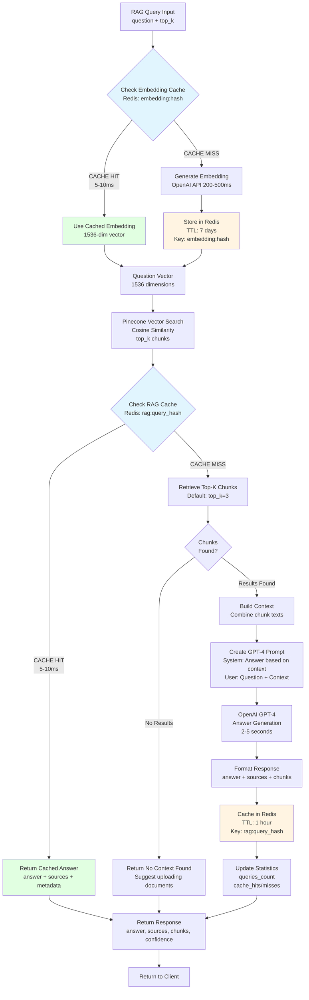

# RAG Query Execution

## Overview
Detailed flow showing how document queries are processed through embedding generation, vector search, context retrieval, and GPT-4 answer generation with multi-level caching.

## Flow Diagram



## Key Components

### Embedding Cache (Redis)
Located in `app/services/query_cache_service.py`

**Configuration:**
- **Key Pattern**: `embedding:{sha256(question)}`
- **TTL**: 7 days (604800 seconds)
- **Value**: JSON with `embedding` array (1536 floats)
- **Hit Rate**: 60% (common questions re-asked)

**Benefits:**
- 200-500ms → 5-10ms latency (95% reduction)
- $0.13 per 1K queries → near-zero for cached
- Reduces OpenAI API load

### Vector Search (Pinecone)
Located in `app/services/vector_service.py`

**Configuration:**
- **Index**: `rag-documents` (dimension: 1536)
- **Metric**: Cosine similarity
- **Top-K**: Default 3, max 10 (configurable)
- **Filters**: Can filter by namespace, metadata

**Process:**
1. Send question embedding to Pinecone
2. Retrieve top-k most similar chunks (score > 0.7 recommended)
3. Return matches with metadata: `{id, score, text, filename, chunk_index}`

**Performance:**
- Latency: 50-100ms for top-3 search
- Scales to millions of vectors
- No local storage required

### RAG Response Cache (Redis)
Located in `app/services/rag_service.py`

**Configuration:**
- **Key Pattern**: `rag:{sha256(question + top_k)}`
- **TTL**: 1 hour (3600 seconds)
- **Value**: JSON with `{answer, sources, chunks, timestamp, tokens_used}`
- **Hit Rate**: 40-60% (frequently asked questions)

**Benefits:**
- 2-5s → 5-10ms latency (99% reduction)
- $15-30 per 1K queries → near-zero for cached
- Consistent answers for same questions

### Context Building
Located in `app/services/rag_service.py`

**Strategy:**
```python
context = "\n\n".join([
    f"[Source: {chunk.filename}, Chunk {chunk.chunk_index}]\n{chunk.text}"
    for chunk in top_k_chunks
])
```

**Format:**
```
[Source: pricing_policy.pdf, Chunk 0]
Our return policy allows customers to return items within 30 days...

[Source: shipping_guide.docx, Chunk 5]
Standard shipping takes 3-5 business days...

[Source: faq.json, Chunk 12]
Free shipping is available for orders over $50...
```

### GPT-4 Answer Generation
Located in `app/services/rag_service.py`

**Prompt Template:**
```
System: You are a helpful assistant. Answer the user's question based ONLY on the provided context. If the context doesn't contain the answer, say so clearly.

User:
Question: {question}

Context:
{context_from_chunks}

Please provide a clear, concise answer.
```

**Configuration:**
- **Model**: GPT-4-turbo-preview (128K context)
- **Temperature**: 0.3 (low randomness for factual answers)
- **Max Tokens**: 500 (concise responses)
- **Stream**: False (wait for complete answer)

### Response Format

**Success Response:**
```json
{
  "answer": "Based on the documents, our return policy allows...",
  "sources": [
    {
      "filename": "pricing_policy.pdf",
      "chunk_index": 0,
      "similarity_score": 0.89,
      "text": "Our return policy allows customers..."
    }
  ],
  "chunks_retrieved": 3,
  "cached": false,
  "query_type": "DOCUMENTS",
  "execution_time_ms": 2345
}
```

**No Context Response:**
```json
{
  "answer": "I couldn't find relevant information in the uploaded documents.",
  "sources": [],
  "chunks_retrieved": 0,
  "suggestion": "Please upload documents containing information about your question.",
  "query_type": "DOCUMENTS"
}
```

## Important Notes

- **Context Window**: GPT-4 supports up to 128K tokens, allowing for many retrieved chunks
- **Source Attribution**: Every chunk is tagged with filename and chunk index for traceability
- **Similarity Threshold**: Chunks with score < 0.7 are typically not relevant (filtered out)
- **Cache Invalidation**: RAG cache cleared when new documents uploaded (may contain new info)
- **Token Tracking**: Tracks embedding tokens + completion tokens for cost monitoring

## Performance Metrics

| Scenario | Latency | Cost per Query | Cache Hit Rate |
|----------|---------|----------------|----------------|
| **Full Pipeline (No Cache)** | 2.5-5s | $0.15-0.30 | 0% |
| **Embedding Cached** | 2-4.5s | $0.15-0.30 | 60% |
| **Full Response Cached** | 5-10ms | ~$0.00 | 40% |
| **Blended Average** | 1-2s | $0.06-0.12 | 60% overall |

**Breakdown:**
- Embedding generation: 200-500ms ($0.13 per 1K)
- Vector search: 50-100ms (included in Pinecone plan)
- GPT-4 answer: 2-5s ($15-30 per 1K)
- Redis cache lookup: 5-10ms ($0.01 per 1K)

## Example Scenarios

### Scenario 1: First-Time Query (No Cache)
**Query**: "What is our return policy?"

1. Check embedding cache → MISS
2. Generate embedding → 300ms
3. Store in Redis (7-day TTL)
4. Search Pinecone → 75ms → 3 chunks found
5. Check RAG cache → MISS
6. Build context from 3 chunks
7. Call GPT-4 → 3.2s
8. Format response with sources
9. Store in Redis (1-hour TTL)
10. **Total: 3.6 seconds, $0.18**

### Scenario 2: Repeated Query (Embedding Cached)
**Query**: "What is our return policy?" (asked again)

1. Check embedding cache → HIT (7ms)
2. Use cached embedding
3. Search Pinecone → 68ms → 3 chunks found
4. Check RAG cache → HIT (6ms)
5. Return cached answer with sources
6. **Total: 81ms, ~$0.00**

### Scenario 3: Similar Query (Partial Cache)
**Query**: "What is your return policy for damaged items?"

1. Check embedding cache → MISS (different question)
2. Generate embedding → 320ms
3. Store in Redis
4. Search Pinecone → 72ms → 3 chunks found (similar to Scenario 1)
5. Check RAG cache → MISS (different question text)
6. Build context from 3 chunks
7. Call GPT-4 → 2.9s
8. Store in Redis
9. **Total: 3.3 seconds, $0.17**

### Scenario 4: No Relevant Documents
**Query**: "What is the meaning of life?"

1. Generate embedding → 280ms
2. Search Pinecone → 65ms → 0 relevant chunks (all scores < 0.7)
3. Return "No context found" message
4. Suggest uploading relevant documents
5. **Total: 345ms, $0.13** (no GPT-4 call)

## Related Workflows
- [Unified Query Flow](02-unified-query-flow.md) - How queries route to RAG
- [Document Upload Pipeline](03-document-upload-pipeline.md) - How documents get indexed
- [Multi-Level Cache](06-multi-level-cache.md) - Caching architecture details
- [Cache Invalidation](08-cache-invalidation.md) - When RAG cache is cleared
