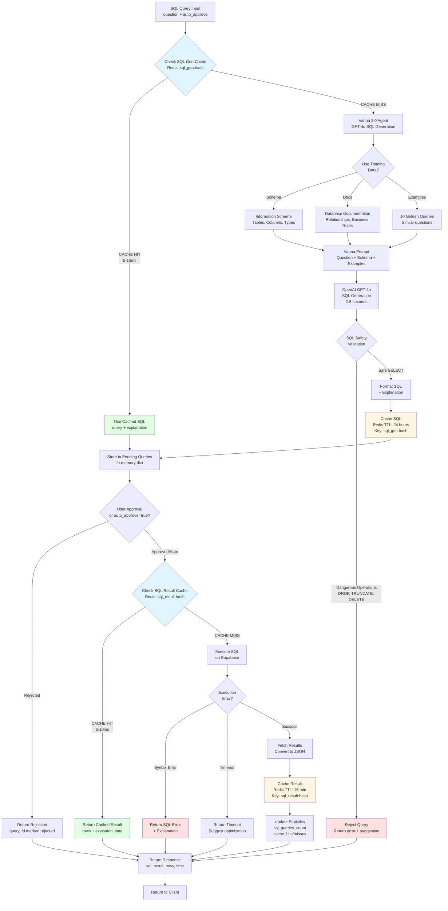

# SQL Query Execution

## Overview
Text-to-SQL workflow showing SQL generation via Vanna 2.0 Agent, caching, user approval process, query execution, and result caching.

## Flow Diagram



## Key Components

### Vanna 2.0 Agent
Located in `app/services/sql_service.py`

**Configuration:**
- **Model**: OpenAI GPT-4o (optimized for structured output)
- **Vector DB**: Pinecone index `vanna-sql-training`
- **Training Data**: Schema + Docs + 10 golden query examples

**Initialization:**
```python
from vanna.openai import OpenAI_Chat
from vanna.pinecone import Pinecone_VectorStore

class VannaAgent(OpenAI_Chat, Pinecone_VectorStore):
    def __init__(self):
        # Connect to Pinecone and OpenAI
        # Train on schema + documentation + examples
```

### Training Data

#### Schema Training
Automatically extracts from `information_schema`:
```sql
SELECT table_name, column_name, data_type
FROM information_schema.columns
WHERE table_schema = 'public'
```

**Learned Entities:**
- Tables: `customers`, `orders`, `products`
- Columns: `customer_id`, `order_date`, `total_amount`, etc.
- Types: `integer`, `varchar`, `timestamp`, `numeric`

#### Documentation Training
```python
vn.train(documentation="""
E-commerce database with 3 main tables:
- customers: Customer information (id, name, email, created_at)
- orders: Order transactions (id, customer_id, order_date, total_amount, status)
- products: Product catalog (id, name, category, price, stock)

Relationships:
- orders.customer_id → customers.id (one customer, many orders)
- Each order contains line items (future: order_items table)

Business Rules:
- Order status: pending, completed, cancelled, refunded
- Total amount includes tax and shipping
- Created_at timestamps in UTC
""")
```

#### Golden Query Examples
10 pre-defined question-SQL pairs:
1. "How many customers?" → `SELECT COUNT(*) FROM customers`
2. "Show top 10 customers by orders" → `SELECT c.name, COUNT(o.id)...`
3. "Total revenue in 2024?" → `SELECT SUM(total_amount)...`
4. Complex JOINs, GROUP BY, aggregations, date filtering

### SQL Generation Cache (Redis)
Located in `app/services/query_cache_service.py`

**Configuration:**
- **Key Pattern**: `sql_gen:{sha256(question)}`
- **TTL**: 24 hours (86400 seconds)
- **Value**: JSON with `{sql, explanation, confidence, timestamp}`
- **Hit Rate**: 60% (common analytics queries)

**Benefits:**
- 2-5s → 5-10ms latency (99% reduction)
- $0.20 per query → near-zero for cached
- Consistent SQL for same questions

### Approval Workflow
Located in `app/services/sql_service.py`

**Pending Queries Storage:**
```python
pending_queries = {
    "query_id_123": {
        "question": "How many orders in 2024?",
        "sql": "SELECT COUNT(*) FROM orders WHERE...",
        "explanation": "This query counts orders...",
        "status": "pending",  # or "approved", "rejected"
        "created_at": "2024-01-15T10:30:00Z"
    }
}
```

**Approval Flow:**
1. `POST /sql/generate` → Generates SQL → Stores in pending → Returns `query_id`
2. User reviews SQL and explanation
3. `POST /sql/execute` with `query_id` → Executes approved SQL
4. Or set `auto_approve_sql=true` in original query to skip approval

### SQL Safety Validation
Located in `app/utils.py`

**Blocked Operations:**
- `DROP TABLE`, `DROP DATABASE`, `DROP INDEX`
- `TRUNCATE`
- `DELETE` without WHERE clause
- `UPDATE` without WHERE clause
- `ALTER TABLE`, `CREATE`, `INSERT`
- `;` (multiple statements)

**Allowed:**
- `SELECT` statements only
- JOINs, subqueries, CTEs
- Aggregations, GROUP BY, ORDER BY
- Window functions

### SQL Result Cache (Redis)
Located in `app/services/query_cache_service.py`

**Configuration:**
- **Key Pattern**: `sql_result:{sha256(sql_query)}`
- **TTL**: 15 minutes (900 seconds)
- **Value**: JSON with `{rows, columns, execution_time_ms, timestamp}`
- **Hit Rate**: 40% (dashboards, repeated analytics)

**Benefits:**
- 50-200ms → 5-10ms latency (95% reduction)
- Reduces database load
- Faster dashboard rendering

**Note**: Shorter TTL (15 min) vs SQL generation (24 hours) because data changes frequently

## Important Notes

- **Read-Only**: Only SELECT queries allowed for safety
- **IPv4 Compatibility**: Uses Supabase Session Pooler for AWS Lambda (no IPv6 support)
- **Connection String**: Format `postgres.{project-ref}@aws-1-ap-south-1.pooler.supabase.com`
- **Query Timeout**: 30 seconds max execution time
- **Token Tracking**: Tracks GPT-4o tokens for SQL generation cost monitoring

## Performance Metrics

| Scenario | Latency | Cost per Query | Cache Hit Rate |
|----------|---------|----------------|----------------|
| **Full Pipeline (No Cache)** | 2.5-5s (gen) + 50-200ms (exec) | $0.20-0.40 | 0% |
| **SQL Cached, Result Uncached** | 10ms (load) + 50-200ms (exec) | $0.00 | 60% (SQL gen) |
| **Full Result Cached** | 5-10ms | ~$0.00 | 40% (result) |
| **Blended Average** | 1-2s | $0.08-0.16 | 70% overall |

**Breakdown:**
- SQL generation: 2-5s ($0.20 per query with GPT-4o)
- SQL execution: 50-200ms (included in Supabase plan)
- Redis cache lookup: 5-10ms ($0.01 per 1K)

## Example Scenarios

### Scenario 1: First-Time Query (No Cache)
**Query**: "Show top 5 customers by total order amount"

1. Check SQL gen cache → MISS
2. Vanna 2.0 generates SQL → 3.1s
   ```sql
   SELECT c.name, c.email, SUM(o.total_amount) as total_spent
   FROM customers c
   JOIN orders o ON c.id = o.customer_id
   GROUP BY c.id, c.name, c.email
   ORDER BY total_spent DESC
   LIMIT 5
   ```
3. Store in Redis (24-hour TTL)
4. Store in pending queries → `query_id_abc`
5. Return for approval
6. User approves → `POST /sql/execute?query_id=query_id_abc`
7. Check result cache → MISS
8. Execute on Supabase → 120ms
9. Store result in Redis (15-min TTL)
10. **Total: 3.2s (gen) + 120ms (exec), $0.22**

### Scenario 2: Repeated Query (SQL Cached)
**Query**: "Show top 5 customers by total order amount" (same question)

1. Check SQL gen cache → HIT (7ms)
2. Load cached SQL
3. Check result cache → HIT (6ms)
4. Return cached result
5. **Total: 13ms, ~$0.00**

### Scenario 3: Similar Query (SQL Cached, Data Changed)
**Query**: "Show top 5 customers by total order amount" (asked after 20 minutes)

1. Check SQL gen cache → HIT (8ms)
2. Load cached SQL
3. Check result cache → MISS (15-min TTL expired)
4. Execute on Supabase → 115ms
5. Store new result in Redis
6. **Total: 123ms, ~$0.00**

### Scenario 4: Dangerous Query (Blocked)
**Query**: "Delete all orders from 2023"

1. Vanna generates: `DELETE FROM orders WHERE order_date >= '2023-01-01'...`
2. Safety validation → FAIL (DELETE operation)
3. Return error: "Dangerous SQL operation detected. Only SELECT queries allowed."
4. Suggest: "Try: 'Show orders from 2023' instead"
5. **Total: ~3s (generation only), $0.20**

### Scenario 5: Auto-Approve Mode
**Query**: "How many customers?" with `auto_approve_sql=true`

1. Check SQL gen cache → MISS
2. Vanna generates: `SELECT COUNT(*) FROM customers` → 2.3s
3. Safety validation → PASS
4. Skip pending queue, execute immediately → 45ms
5. Store SQL + result in Redis
6. **Total: 2.35s, $0.20**

## Related Workflows
- [Unified Query Flow](02-unified-query-flow.md) - How queries route to SQL
- [Multi-Level Cache](06-multi-level-cache.md) - SQL caching details
- [System Architecture](01-system-architecture.md) - SQL service in overall system
