# Service Initialization

## Overview
Startup sequence showing how all services initialize with dependency management, configuration validation, and graceful degradation when optional services are unavailable.

## Initialization Flow

```mermaid
flowchart TD
    Start[FastAPI App Startup] --> LoadEnv[Load Environment Variables<br/>.env file]

    LoadEnv --> Config[Initialize Configuration<br/>app/config.py]

    Config --> OPIK{OPIK_API_KEY<br/>configured?}

    OPIK -->|Yes| InitOPIK[Initialize OPIK Client<br/>Set workspace + project]
    OPIK -->|No| SkipOPIK[Skip OPIK<br/>Continue without monitoring]

    InitOPIK --> OPIKSuccess{OPIK Connection<br/>Successful?}
    OPIKSuccess -->|Yes| OPIKReady[OPIK Ready<br/>@track decorators active]
    OPIKSuccess -->|No| OPIKFail[OPIK Failed<br/>Log warning, continue]

    OPIKReady --> InitCache[Initialize Query Cache Service<br/>Connect to Upstash Redis]
    SkipOPIK --> InitCache
    OPIKFail --> InitCache

    InitCache --> RedisTest{Test Redis<br/>Connection}

    RedisTest -->|Success| RedisReady[Query Cache Ready<br/>All cache types available]
    RedisTest -->|Fail| RedisFail[Query Cache Unavailable<br/>Services degrade gracefully]

    RedisReady --> CheckRAG{Check RAG<br/>Requirements}
    RedisFail --> CheckRAG

    CheckRAG -->|OPENAI_API_KEY + PINECONE_API_KEY| InitRAG[Initialize RAG Services]
    CheckRAG -->|Missing Keys| SkipRAG[Skip RAG Services<br/>RAG queries will fail with 503]

    InitRAG --> Embed[1. Initialize Embedding Service<br/>OpenAI client + Query Cache injection]

    Embed --> TestEmbed{Test OpenAI<br/>Connection}

    TestEmbed -->|Success| Vector[2. Initialize Vector Service<br/>Pinecone client + gRPC]
    TestEmbed -->|Fail| RAGFail[RAG Services Failed<br/>Log error, continue]

    Vector --> TestPinecone{Test Pinecone<br/>Connection}

    TestPinecone -->|Success| RAGSvc[3. Initialize RAG Service<br/>Combine Embed + Vector + OpenAI GPT-4]
    TestPinecone -->|Fail| RAGFail

    RAGSvc --> RAGReady[RAG Services Ready<br/>Document queries enabled]

    RAGReady --> CheckSQL{Check SQL<br/>Requirements}
    SkipRAG --> CheckSQL
    RAGFail --> CheckSQL

    CheckSQL -->|DATABASE_URL + OPENAI_API_KEY| InitSQL[Initialize SQL Service]
    CheckSQL -->|Missing Keys| SkipSQL[Skip SQL Service<br/>SQL queries will fail with 503]

    InitSQL --> Vanna[1. Initialize Vanna 2.0 Agent<br/>OpenAI + Pinecone Vector Store]

    Vanna --> TestDB{Test Database<br/>Connection}

    TestDB -->|Success| Train[2. Train Vanna Agent<br/>Schema + Docs + Examples]
    TestDB -->|Fail| SQLFail[SQL Service Failed<br/>Log error, continue]

    Train --> Schema[Load Schema<br/>information_schema.columns]
    Schema --> Docs[Load Documentation<br/>Table relationships + business rules]
    Docs --> Examples[Load Golden Queries<br/>10 example Q&A pairs]

    Examples --> SQLReady[SQL Service Ready<br/>Text-to-SQL enabled]

    SQLReady --> InitDocCache[Initialize Document Cache Service<br/>S3 or Local Storage]
    SkipSQL --> InitDocCache
    SQLFail --> InitDocCache

    InitDocCache --> Backend{Select Storage<br/>Backend}

    Backend -->|AWS_ACCESS_KEY_ID exists| TestS3{Test S3<br/>Connection}
    Backend -->|No AWS creds| LocalStorage[Use Local Storage<br/>./document_cache/]

    TestS3 -->|Success| S3Backend[S3 Backend Ready<br/>Production mode]
    TestS3 -->|Fail| FallbackLocal[S3 Failed<br/>Fallback to local storage]

    S3Backend --> DocReady[Document Cache Ready]
    LocalStorage --> DocReady
    FallbackLocal --> DocReady

    DocReady --> Health[Update Health Status<br/>Service availability flags]

    Health --> Ready[All Services Initialized<br/>App Ready to Serve Requests]

    Ready --> Listen[Listen on Port 8000<br/>HTTP Server Started]

    style OPIKReady fill:#e1ffe1
    style RedisReady fill:#e1ffe1
    style RAGReady fill:#e1ffe1
    style SQLReady fill:#e1ffe1
    style DocReady fill:#e1ffe1
    style Ready fill:#e1ffe1

    style OPIKFail fill:#ffe1e1
    style RedisFail fill:#ffe1e1
    style RAGFail fill:#ffe1e1
    style SQLFail fill:#ffe1e1

    style SkipOPIK fill:#fff4e1
    style SkipRAG fill:#fff4e1
    style SkipSQL fill:#fff4e1
```



## Service Dependencies

### Configuration Service
**File**: `app/config.py`

**Loaded Variables:**
```python
# Required for RAG
OPENAI_API_KEY: str
PINECONE_API_KEY: str
PINECONE_ENVIRONMENT: str
PINECONE_INDEX_NAME: str

# Required for SQL
DATABASE_URL: str  # Supabase Session Pooler (IPv4)

# Required for Query Cache
REDIS_URL: str  # Upstash Redis connection string

# Optional for Monitoring
OPIK_API_KEY: Optional[str]
OPIK_WORKSPACE: str = "default"
OPIK_PROJECT: str = "rag-text-to-sql"

# Optional for Document Cache
AWS_ACCESS_KEY_ID: Optional[str]
AWS_SECRET_ACCESS_KEY: Optional[str]
AWS_S3_BUCKET: Optional[str]
AWS_REGION: str = "us-east-1"

# Feature flags
CHUNK_SIZE: int = 512
CHUNK_OVERLAP: int = 50
MAX_FILE_SIZE_MB: int = 50
```

### OPIK Monitoring (Optional)
**File**: `app/main.py` (lifespan event)

**Initialization:**
```python
from opik import Opik
from opik.integrations.openai import track_openai

if OPIK_API_KEY:
    try:
        opik_client = Opik(
            api_key=OPIK_API_KEY,
            workspace=OPIK_WORKSPACE,
            project=OPIK_PROJECT
        )
        track_openai()  # Auto-track OpenAI API calls
        logger.info("OPIK monitoring initialized")
    except Exception as e:
        logger.warning(f"OPIK init failed: {e}, continuing without monitoring")
        opik_client = None
else:
    logger.info("OPIK_API_KEY not set, skipping monitoring")
    opik_client = None
```

**Graceful Degradation**: If OPIK fails, app continues without tracing.

### Query Cache Service
**File**: `app/services/query_cache_service.py`

**Initialization:**
```python
class QueryCacheService:
    def __init__(self, redis_url: str):
        self.redis_client = redis.from_url(
            redis_url,
            decode_responses=True,
            socket_connect_timeout=5,
            socket_timeout=5
        )
        # Test connection
        self.redis_client.ping()
```

**Dependencies**: None (required service)

**Failure Impact**: If Redis unavailable, services still work but without caching (higher latency + cost).

### RAG Services
**Files**: `app/services/embedding_service.py`, `app/services/vector_service.py`, `app/services/rag_service.py`

**Initialization Order:**
1. **EmbeddingService** (depends on QueryCacheService)
   ```python
   class EmbeddingService:
       def __init__(self, openai_api_key: str, query_cache: QueryCacheService):
           self.client = OpenAI(api_key=openai_api_key)
           self.cache = query_cache
   ```

2. **VectorService** (depends on EmbeddingService)
   ```python
   class VectorService:
       def __init__(self, api_key: str, environment: str, index_name: str,
                    embedding_service: EmbeddingService):
           self.pc = Pinecone(api_key=api_key, environment=environment)
           self.index = self.pc.Index(index_name)
           self.embedding_service = embedding_service
   ```

3. **RAGService** (depends on VectorService + QueryCacheService)
   ```python
   class RAGService:
       def __init__(self, openai_api_key: str, vector_service: VectorService,
                    query_cache: QueryCacheService):
           self.client = OpenAI(api_key=openai_api_key)
           self.vector_service = vector_service
           self.cache = query_cache
   ```

**Required Keys**: `OPENAI_API_KEY`, `PINECONE_API_KEY`, `PINECONE_ENVIRONMENT`, `PINECONE_INDEX_NAME`

**Failure Impact**: If any service fails, RAG queries return HTTP 503 "Service Unavailable".

### SQL Service
**File**: `app/services/sql_service.py`

**Initialization:**
```python
from vanna.openai import OpenAI_Chat
from vanna.pinecone import Pinecone_VectorStore

class VannaAgent(OpenAI_Chat, Pinecone_VectorStore):
    def __init__(self, openai_api_key: str, pinecone_api_key: str,
                 database_url: str, query_cache: QueryCacheService):
        # Initialize Vanna with OpenAI + Pinecone
        # Connect to database
        # Inject query cache

        # Train on startup
        self._train_on_schema()
        self._train_on_documentation()
        self._train_on_examples()
```

**Training Process:**
1. Extract schema from `information_schema`
2. Load documentation string
3. Load 10 golden query examples
4. Train Vanna agent (stores in Pinecone index `vanna-sql-training`)

**Required Keys**: `DATABASE_URL`, `OPENAI_API_KEY`, `PINECONE_API_KEY`

**Failure Impact**: If initialization fails, SQL queries return HTTP 503 "Service Unavailable".

**Note**: Uses Supabase Session Pooler for IPv4 compatibility (AWS Lambda doesn't support IPv6).

### Document Cache Service
**File**: `app/services/document_cache_service.py`

**Initialization:**
```python
class DocumentCacheService:
    def __init__(self, backend: str = "auto"):
        if backend == "auto":
            # Try S3 if AWS credentials exist
            if AWS_ACCESS_KEY_ID and AWS_SECRET_ACCESS_KEY:
                self.backend = S3Backend()
            else:
                self.backend = LocalBackend()
        elif backend == "s3":
            self.backend = S3Backend()
        else:
            self.backend = LocalBackend()
```

**Backends:**
- **S3Backend**: Production, requires AWS credentials
- **LocalBackend**: Development, uses `./document_cache/` directory

**Dependencies**: None (always available, falls back to local)

**Failure Impact**: None (graceful fallback to local storage)

## Dependency Injection

Services are injected into FastAPI endpoints using dependency injection:

```python
from fastapi import Depends

# Global service instances
query_cache_service: Optional[QueryCacheService] = None
rag_service: Optional[RAGService] = None
sql_service: Optional[SQLService] = None
document_cache_service: DocumentCacheService = None

# Dependency getters
def get_rag_service() -> RAGService:
    if rag_service is None:
        raise HTTPException(503, "RAG service not configured")
    return rag_service

# Endpoint usage
@app.post("/query/documents")
async def query_documents(
    query: QueryRequest,
    rag_svc: RAGService = Depends(get_rag_service)
):
    return await rag_svc.query(query.question)
```

## Health Check Endpoint

**Endpoint**: `GET /health`

**Response:**
```json
{
  "status": "healthy",
  "services": {
    "query_cache": {
      "available": true,
      "latency_ms": 5
    },
    "rag": {
      "available": true,
      "openai": "connected",
      "pinecone": "connected"
    },
    "sql": {
      "available": true,
      "database": "connected",
      "vanna": "trained"
    },
    "document_cache": {
      "available": true,
      "backend": "s3",
      "documents_cached": 45
    }
  },
  "version": "1.0.0",
  "uptime_seconds": 3600
}
```

## Error Handling

### Missing Required Keys
If required environment variables are missing:
```python
if not OPENAI_API_KEY:
    logger.error("OPENAI_API_KEY not set, RAG services disabled")
    rag_service = None
```

### Service Connection Failures
If external service connection fails:
```python
try:
    pinecone.init(api_key=PINECONE_API_KEY, environment=PINECONE_ENVIRONMENT)
    index = pinecone.Index(PINECONE_INDEX_NAME)
    index.describe_index_stats()  # Test connection
except Exception as e:
    logger.error(f"Pinecone connection failed: {e}")
    rag_service = None
```

### Graceful Degradation
When services unavailable, endpoints return HTTP 503:
```python
@app.post("/query/documents")
async def query_documents(query: QueryRequest):
    if rag_service is None:
        raise HTTPException(
            status_code=503,
            detail={
                "error": "RAG service unavailable",
                "reason": "OpenAI or Pinecone not configured",
                "suggestion": "Set OPENAI_API_KEY and PINECONE_API_KEY in .env"
            }
        )
```

## Startup Logs

Example successful startup:
```
INFO: Loading environment variables from .env
INFO: Configuration loaded successfully
INFO: OPIK monitoring initialized (workspace: default, project: rag-text-to-sql)
INFO: Query Cache Service connected to Redis (latency: 7ms)
INFO: Embedding Service initialized (model: text-embedding-3-small)
INFO: Vector Service connected to Pinecone (index: rag-documents, vectors: 1234)
INFO: RAG Service initialized successfully
INFO: SQL Service connected to database (Supabase Session Pooler)
INFO: Vanna Agent training started...
INFO: Schema training complete (3 tables, 15 columns)
INFO: Documentation training complete
INFO: Golden queries training complete (10 examples)
INFO: SQL Service initialized successfully
INFO: Document Cache Service using S3 backend (bucket: my-rag-bucket)
INFO: All services initialized, app ready
INFO: Uvicorn running on http://0.0.0.0:8000
```

Example degraded startup (missing SQL):
```
INFO: Loading environment variables from .env
WARNING: DATABASE_URL not set, SQL service disabled
INFO: Query Cache Service connected to Redis
INFO: RAG Service initialized successfully
INFO: Document Cache Service using local backend
WARNING: SQL queries will return 503 - Service Unavailable
INFO: App ready (RAG only mode)
```

## Important Notes

- **Order Matters**: Services must initialize in dependency order (cache → embedding → vector → rag)
- **Lazy Loading**: Services only initialize if required keys are present
- **Fail-Safe**: App can run with partial services (e.g., RAG only, SQL only, or both)
- **Lambda Cold Starts**: All services must initialize within 10s Lambda timeout
- **Connection Pooling**: Database connections use session pooler for Lambda compatibility
- **Retry Logic**: Services retry connections 3x with exponential backoff

## Performance Metrics

| Service | Init Time | Dependencies | Can Skip? |
|---------|-----------|--------------|-----------|
| Configuration | 10ms | None | No |
| OPIK | 500ms | OPIK_API_KEY | Yes |
| Query Cache | 100ms | REDIS_URL | Yes (degrades) |
| Embedding Service | 200ms | OpenAI API | No (for RAG) |
| Vector Service | 300ms | Pinecone API | No (for RAG) |
| RAG Service | 100ms | Embed + Vector | Yes |
| SQL Service | 2-5s | Database + Training | Yes |
| Document Cache | 200ms | S3 or Local | No (falls back) |
| **Total (All Services)** | **3-6 seconds** | | |
| **Total (Minimal)** | **500ms** | Configuration + Doc Cache | |

## Related Workflows
- [System Architecture](01-system-architecture.md) - How initialized services fit together
- [Multi-Level Cache](06-multi-level-cache.md) - Query Cache Service details
- [RAG Query Execution](04-rag-query-execution.md) - How RAG services are used
- [SQL Query Execution](05-sql-query-execution.md) - How SQL service is used
